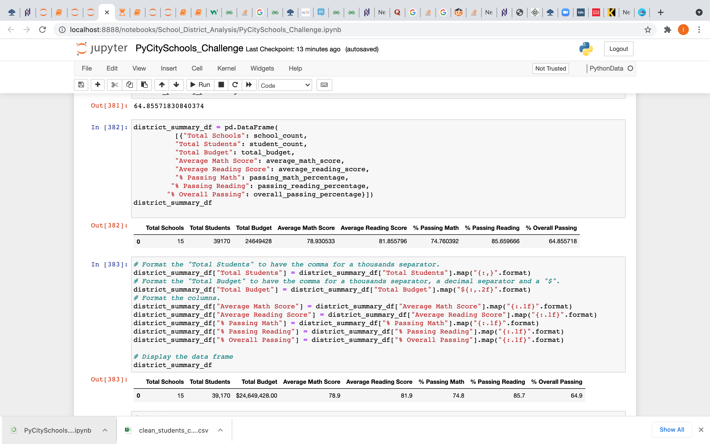

##  Overview of School District Analysis:
The purpose of this analysis is to help the school board uphold state-testing standards. Reading and math grades for Thomas High School ninth graders appear to have been altered in 'students_complete.csv'. By replacing the math and reading scores for Thomas High School with NaNs while and keeping the rest of the data intact, the school district analysis is repeated to know how these changes affected the overall analysis.

## Results:

#### *How is the district Summary affected?* 

The district summary score is reduced when the math and reading score of the ninth graders in  Thomas High School is replaced with NaN. The average math score and the average reading score is reduced by few marks and the overall passing % have been dropped to 0.1%.

#### *How is the School Summary affected?* 

Thomas High School is seen flourishing when the ninth graders are taken out. The overall passing % is increased from 65% to 91% when the ninth graders are not calculated. Also there is a significant increase in math and reading scores as well.

#### *How does replacing the ninth graders math and reading scores affect Thomas High School’s performance relative to the other schools?*

Ninth graders of Thomas High School have been pulling down the school among the overall schools. When the ninth graders math and reading scores  have been replaced with NaN the school seems to be doing well among the other schools making it to the top five schools.

#### *How does replacing the ninth-grade scores affect the following:*

* **Math and reading scores by grade**:

 Thomas High School comes to the top 5 schools when the math and the reading of the THS 9 th graders are not accounted.

* **Scores by school spending**:

Thomas High School spends around $640 for each student which is already among the top in the spending bins.

* **Scores by school size**:

When the school size is medium around 1000-2000 students, the overall passing is around 91%.

* **Scores by school type**:

The Charter school tends to do well with the overall passing of 90% compared to district schools.

## Summary:

1. The district score is reduced to 0.1% after reading and math scores for the ninth grade at Thomas High School have been replaced with NaNs.

2. The School score on overall passing for Thomas High School is increased from 65% to 91%

3. Thomas High School comes to the top fives schools after reading and math scores for the ninth grade at Thomas High School have been replaced with NaNs.

4. The size of the school is reduced.

